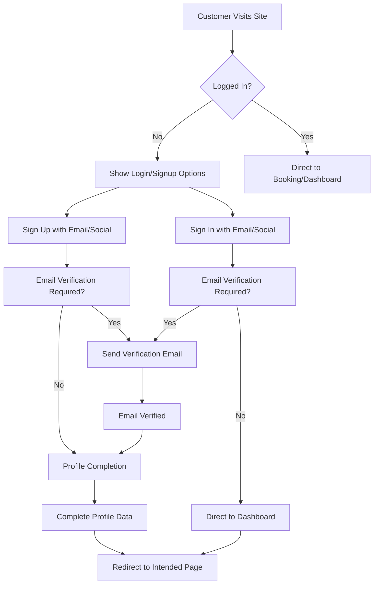
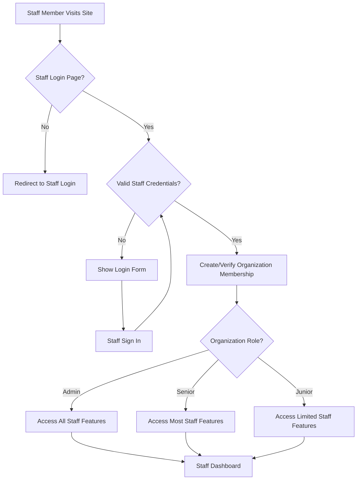
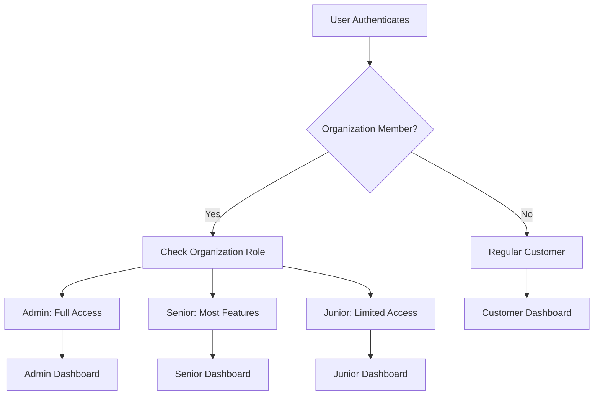

# Clerk Authentication System Architecture Plan

## Executive Summary

This document outlines the complete architecture for migrating to a unified Clerk-based authentication system for the Zavira booking and service management platform. The plan covers both customer and staff authentication using Clerk Organizations for role-based access control, providing a secure, scalable, and user-friendly authentication experience.

**Key Benefits:**
- Unified authentication system for customers and staff
- Enhanced security with Clerk's enterprise-grade infrastructure
- Simplified user experience with social login options
- Role-based access control using Clerk Organizations
- Reduced maintenance burden with managed authentication

---

## 1. Authentication Flow Architecture

### 1.1 Customer Authentication Flow



### 1.2 Staff Authentication Flow



### 1.3 Role-Based Access Control



---

## 2. Frontend Component Structure

### 2.1 Page Structure

```
src/pages/auth/
├── SignInPage.tsx          # Customer sign-in with social options
├── SignUpPage.tsx          # Customer sign-up with profile completion
├── StaffSignInPage.tsx     # Dedicated staff login page
├── OAuthCallback.tsx       # Handle OAuth redirects
├── ProfileCompletion.tsx   # Post-signup profile data collection
└── ForgotPassword.tsx      # Password reset functionality

src/components/auth/
├── AuthLayout.tsx          # Shared authentication layout
├── SocialLoginButtons.tsx  # Reusable social login component
├── StaffRoleGuard.tsx      # Protect staff-only routes
├── CustomerRoleGuard.tsx   # Protect customer routes
└── ProfileForm.tsx         # User profile completion form
```

### 2.2 Route Protection Strategy

```typescript
// Protected route configurations
const PROTECTED_ROUTES = {
  // Customer routes
  '/dashboard': {
    requireAuth: true,
    allowRoles: ['customer', 'staff'],
    redirectTo: '/auth'
  },
  '/booking': {
    requireAuth: false, // Allow guest bookings
    allowRoles: ['customer', 'staff'],
    redirectTo: '/auth'
  },
  
  // Staff routes
  '/staff': {
    requireAuth: true,
    requireOrganization: 'Zavira Staff',
    allowRoles: ['admin', 'senior', 'junior'],
    redirectTo: '/auth/staff-login'
  },
  '/admin/*': {
    requireAuth: true,
    requireOrganization: 'Zavira Staff',
    allowRoles: ['admin'],
    redirectTo: '/auth/staff-login'
  }
};
```

### 2.3 Clerk Component Integration

```typescript
// Enhanced Clerk components with custom styling
import { SignIn, SignUp, UserProfile, OrganizationSwitcher } from '@clerk/clerk-react';

// Custom styled SignIn component
const CustomSignIn = () => (
  <SignIn
    routing="path"
    path="/auth"
    signUpUrl="/auth/sign-up"
    appearance={{
      elements: {
        formButtonPrimary: 'bg-black text-white hover:bg-gray-800',
        card: 'bg-white shadow-lg',
        headerTitle: 'text-black',
        headerSubtitle: 'text-gray-600',
        socialButtonsBlockButton: 'border border-gray-300 hover:bg-gray-100'
      }
    }}
    socialButtons={['google', 'facebook']}
    forceRedirectUrl="/profile-completion"
  />
);

// Staff-specific SignIn with organization context
const StaffSignIn = () => (
  <SignIn
    routing="path"
    path="/auth/staff-login"
    signUpUrl="/auth/staff-signup"
    appearance={{
      variables: {
        colorPrimary: '#8B5CF6', // Purple theme for staff
      }
    }}
    forceRedirectUrl="/staff/dashboard"
  />
);
```

---

## 3. Backend Integration Strategy

### 3.1 Clerk Organizations Structure

```typescript
// Organization hierarchy for staff management
const ORGANIZATIONS = {
  'Zavira Staff': {
    name: 'Zavira Staff Organization',
    slug: 'zavira-staff',
    roles: {
      admin: {
        permissions: ['admin:all', 'staff:manage', 'settings:all', 'analytics:view'],
        description: 'Full administrative access'
      },
      senior: {
        permissions: ['staff:view', 'bookings:manage', 'analytics:view'],
        description: 'Senior staff with most permissions'
      },
      junior: {
        permissions: ['bookings:view', 'schedule:view'],
        description: 'Junior staff with limited access'
      }
    }
  }
};
```

### 3.2 User Data Management

```typescript
// Clerk user metadata structure
interface UserMetadata {
  // Profile information
  firstName?: string;
  lastName?: string;
  phone?: string;
  dateOfBirth?: string;
  address?: {
    street: string;
    city: string;
    province: string;
    postalCode: string;
    country: string;
  };
  
  // Customer preferences
  preferredStylist?: string;
  servicePreferences?: string[];
  loyaltyPoints?: number;
  
  // Staff-specific metadata (for organization members)
  staffInfo?: {
    employeeId: string;
    hireDate: string;
    specializations: string[];
    hourlyRate?: number;
  };
}
```

### 3.3 API Integration Pattern

```typescript
// Frontend API integration with Clerk
import { useAuth, useUser, useOrganization } from '@clerk/clerk-react';

// Hook for staff-specific operations
const useStaffAuth = () => {
  const { isSignedIn, user } = useUser();
  const { organization } = useOrganization();
  
  const isStaff = organization?.slug === 'zavira-staff';
  const userRole = organization?.membership?.role;
  
  return {
    isStaff,
    userRole,
    canAccessAdmin: userRole === 'admin',
    canManageBookings: ['admin', 'senior'].includes(userRole),
  };
};
```

---

## 4. Environment Variable Requirements

### 4.1 Required Environment Variables

```bash
# Clerk Configuration
VITE_CLERK_PUBLISHABLE_KEY=pk_test_xxxxxxxxxxxxxxxxxxxxx
CLERK_SECRET_KEY=sk_test_xxxxxxxxxxxxxxxxxxxxx

# Clerk Organization Settings (optional - for advanced configuration)
CLERK_ORGANIZATION_ID=org_xxxxxxxxxxxxxxxxxxxxx

# Application Configuration
VITE_APP_URL=https://zavira.ca
VITE_APP_ENV=production

# Social OAuth Credentials (configure in Clerk dashboard)
GOOGLE_CLIENT_ID=your_google_client_id
FACEBOOK_APP_ID=your_facebook_app_id
```

### 4.2 Environment Setup Process

1. **Create Clerk Application:**
   - Sign up at [clerk.com](https://clerk.com)
   - Create new application
   - Configure allowed origins for your domain

2. **Configure Social Providers:**
   - Enable Google OAuth in Clerk dashboard
   - Set up Facebook OAuth (optional)
   - Configure redirect URLs

3. **Set up Organizations:**
   - Create "Zavira Staff" organization
   - Define roles: admin, senior, junior
   - Set up permissions for each role

4. **Environment Configuration:**
   - Add publishable key to Vite environment
   - Add secret key to server environment
   - Configure allowed redirect URLs

---

## 5. Migration Strategy from Supabase Staff System

### 5.1 Current System Analysis

**Existing Staff Data Structure:**
- Staff table with username, password_hash, role, access_level
- Integration with Supabase auth for staff user creation
- Role hierarchy: admin, senior, junior

### 5.2 Migration Plan

#### Phase 1: Preparation (Week 1)
1. **Data Export:**
   - Export all staff records from Supabase
   - Include: username, email, role, access_level, employee_id
   - Prepare staff user list for Clerk import

2. **Clerk Setup:**
   - Create Clerk application
   - Set up organization structure
   - Configure role permissions

#### Phase 2: Staff Migration (Week 2)
1. **Bulk User Creation:**
   - Use Clerk Admin API to create staff accounts
   - Assign to "Zavira Staff" organization
   - Set appropriate roles and permissions

2. **Credential Management:**
   - Implement password reset workflow for staff
   - Send welcome emails with temporary passwords
   - Force password change on first login

#### Phase 3: Frontend Integration (Week 3)
1. **Authentication Flow Updates:**
   - Replace Supabase staff auth with Clerk
   - Update route protection logic
   - Test all staff authentication scenarios

2. **UI/UX Improvements:**
   - Update staff login interface
   - Implement role-based UI components
   - Add organization switcher for staff

#### Phase 4: Cleanup (Week 4)
1. **System Validation:**
   - Test all authentication flows
   - Verify role-based access control
   - Performance testing with new system

2. **Supabase Cleanup:**
   - Remove staff authentication functions
   - Archive old staff data
   - Update documentation

### 5.3 Migration Scripts

```typescript
// Staff data migration script
interface StaffMigrationData {
  username: string;
  email: string;
  role: 'admin' | 'senior' | 'junior';
  accessLevel: 'full' | 'limited' | 'basic';
  employeeId: string;
}

// Bulk migration function
const migrateStaffToClerk = async (staffData: StaffMigrationData[]) => {
  const results = [];
  
  for (const staff of staffData) {
    try {
      // Create user in Clerk
      const user = await clerkClient.users.create({
        emailAddress: staff.email,
        username: staff.username,
        firstName: staff.username.split('.')[0],
        lastName: staff.username.split('.')[1] || '',
        privateMetadata: {
          employeeId: staff.employeeId,
          originalRole: staff.role
        }
      });
      
      // Add to organization
      await clerkClient.organizations.createMembership({
        organizationId: ORG_ID,
        userId: user.id,
        role: mapRoleToClerk(staff.role)
      });
      
      results.push({ success: true, userId: user.id, username: staff.username });
    } catch (error) {
      results.push({ success: false, username: staff.username, error: error.message });
    }
  }
  
  return results;
};
```

---

## 6. Security Considerations

### 6.1 Security Best Practices

1. **Secure Token Management:**
   - Use Clerk's built-in token management
   - Implement proper token refresh logic
   - Never store tokens in localStorage

2. **Role-Based Access Control:**
   - Validate user roles on both client and server
   - Use organization membership for staff access
   - Implement principle of least privilege

3. **Session Security:**
   - Configure appropriate session timeouts
   - Implement session invalidation on logout
   - Use secure cookie settings

### 6.2 Data Privacy Compliance

```typescript
// User data handling with privacy considerations
const handleUserData = (user: User) => {
  // Only collect necessary data
  const minimalData = {
    id: user.id,
    email: user.emailAddresses[0]?.emailAddress,
    firstName: user.firstName,
    lastName: user.lastName,
    // Explicit consent for marketing communications
    marketingConsent: user.unsafeMetadata?.marketingConsent || false
  };
  
  // Store sensitive data in encrypted form
  const sensitiveData = {
    phoneNumber: encrypt(user.phoneNumbers[0]?.phoneNumber),
    dateOfBirth: encrypt(user.unsafeMetadata?.dateOfBirth),
  };
  
  return { minimalData, sensitiveData };
};
```

### 6.3 Audit and Monitoring

```typescript
// Authentication event logging
const logAuthEvent = (event: string, userId: string, metadata?: any) => {
  // Log to audit service
  auditLogger.info('Authentication Event', {
    event,
    userId,
    timestamp: new Date().toISOString(),
    ip: getClientIP(),
    userAgent: navigator.userAgent,
    ...metadata
  });
};
```

---

## 7. Implementation Timeline

### 7.1 Project Phases

| Phase | Duration | Tasks | Deliverables |
|-------|----------|-------|-------------|
| **Phase 1: Setup** | 1 week | Clerk setup, environment config | Clerk app created, env vars configured |
| **Phase 2: Frontend** | 2 weeks | Component development, routing | Auth components, protected routes |
| **Phase 3: Migration** | 1 week | Staff data migration | All staff migrated to Clerk |
| **Phase 4: Testing** | 1 week | QA, security testing | Tested authentication flows |
| **Phase 5: Deployment** | 3 days | Production deployment | Live Clerk authentication |

### 7.2 Priority Implementation Order

1. **High Priority:**
   - Basic authentication flows
   - Staff organization setup
   - Route protection implementation

2. **Medium Priority:**
   - Social login integration
   - Profile completion workflows
   - Password reset functionality

3. **Low Priority:**
   - Advanced role management
   - Audit logging
   - Performance optimization

---

## 8. Testing Strategy

### 8.1 Authentication Flow Testing

```typescript
// Test scenarios for authentication flows
const authTestScenarios = {
  customer: {
    'signUpWithEmail': 'Complete email signup with verification',
    'signInWithGoogle': 'Google OAuth login flow',
    'profileCompletion': 'Post-signup profile data collection',
    'passwordReset': 'Forgot password and reset flow'
  },
  staff: {
    'staffSignIn': 'Staff member login with organization check',
    'roleBasedAccess': 'Verify role-based route protection',
    'organizationSwitching': 'Staff switching between orgs',
    'sessionManagement': 'Session timeout and renewal'
  }
};
```

### 8.2 Security Testing

1. **Authorization Testing:**
   - Verify role-based access controls
   - Test unauthorized access attempts
   - Validate session management

2. **Data Protection Testing:**
   - Ensure sensitive data encryption
   - Test data retention policies
   - Verify GDPR compliance

---

## 9. Monitoring and Analytics

### 9.1 Authentication Metrics

```typescript
// Key metrics to track
const authMetrics = {
  userRegistration: {
    dailySignups: 'Count of new user registrations',
    signupConversionRate: 'Percentage of visitors who sign up',
    socialVsEmailSignup: 'Breakdown of signup methods'
  },
  userEngagement: {
    dailyActiveUsers: 'Number of daily active users',
    sessionDuration: 'Average session length',
    returnUserRate: 'Percentage of returning users'
  },
  staffUsage: {
    staffLoginFrequency: 'Staff login patterns',
    roleDistribution: 'User role breakdown',
    adminActions: 'Administrative actions taken'
  }
};
```

---

## 10. Troubleshooting Guide

### 10.1 Common Issues and Solutions

| Issue | Cause | Solution |
|-------|-------|----------|
| **OAuth redirect fails** | Missing redirect URL config | Add domain to Clerk allowed origins |
| **Staff can't access admin features** | Role not properly assigned | Verify organization membership and role |
| **Email verification not working** | SMTP configuration issue | Check Clerk email settings |
| **Slow authentication** | Large organization membership | Optimize Clerk organization structure |

### 10.2 Support Resources

- **Clerk Documentation:** [clerk.com/docs](https://clerk.com/docs)
- **Support Portal:** [clerk.com/support](https://clerk.com/support)
- **Community Discord:** Clerk Discord server
- **Status Page:** [status.clerk.com](https://status.clerk.com)

---

## 11. Conclusion

This comprehensive Clerk authentication architecture provides a robust, secure, and scalable solution for managing both customer and staff authentication. The migration from the current Supabase-based staff system to a unified Clerk approach will:

- **Simplify maintenance** with a single authentication provider
- **Enhance security** with enterprise-grade authentication infrastructure  
- **Improve user experience** with social login options and streamlined flows
- **Enable role-based access** through Clerk Organizations
- **Reduce development time** with pre-built components and APIs

The phased implementation approach ensures minimal disruption to existing users while providing a clear migration path from the current system.

---

**Document Version:** 1.0  
**Last Updated:** 2025-11-26  
**Next Review:** 2025-12-26