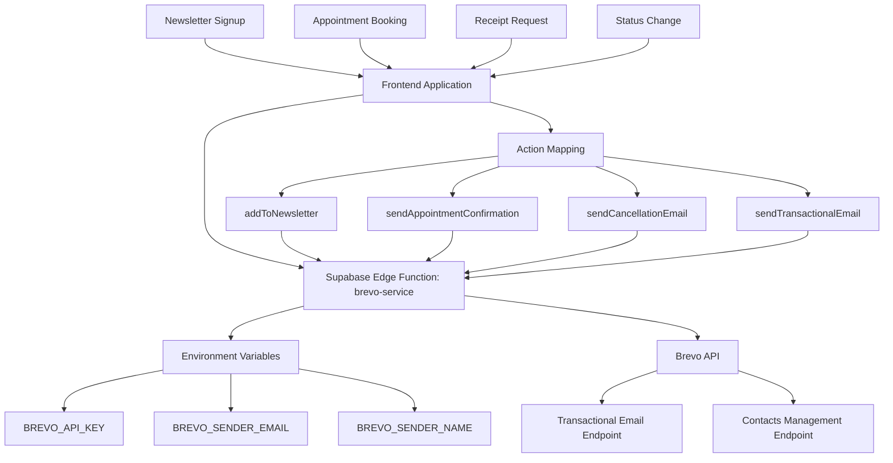

# Brevo Email Integration Architecture Plan

## Executive Summary

This document outlines the complete architecture for implementing a "plug-and-play" Brevo email integration system for the ZAVIRA Beauty salon application. The system will handle both transactional emails (appointment confirmations, cancellations) and newsletter management through a centralized Supabase edge function.

## Current State Analysis

### Existing Brevo Implementation
- **Current Files**: Two existing implementations using different approaches
  - `src/lib/brevo-newsletter.ts` - Uses @sendinblue/client library
  - `src/lib/newsletter.ts` - Uses direct fetch API calls
- **Functionality**: Basic newsletter subscription with welcome emails
- **Limitations**: 
    - Client-side API key exposure
    - No appointment confirmation emails
    - No automated workflows
    - Inconsistent implementation approaches

### Identified Integration Points
1. **Newsletter Signup**: Homepage newsletter form (`src/pages/Index.tsx`)
2. **Appointment Booking**: Email collection in booking flow (`src/pages/Booking.tsx`)
3. **Staff Scheduling**: Email collection for appointments (`src/pages/StaffSchedulingSystem.tsx`)
4. **Receipt Confirmation**: Email receipt functionality (`src/components/ReceiptConfirmationModal.tsx`)
5. **Customer Management**: Customer email management in admin interfaces

## Proposed Architecture

### 1. Backend Design (Supabase Edge Function)

#### New Edge Function: `brevo-service`

**Location**: `supabase/functions/brevo-service/index.ts`

**Functionality**:
- Securely handle Brevo API key from environment variables
- Process multiple email actions through a single endpoint
- Centralize email template management
- Handle error logging and monitoring

**API Endpoints**:

```
POST /functions/v1/brevo-service
```

**Request Payload Structure**:
```typescript
{
  action: 'sendTransactionalEmail' | 'addToNewsletter' | 'sendAppointmentConfirmation' | 'sendCancellationEmail',
  data: {
    // For newsletter subscriptions
    email?: string,
    name?: string,
    source?: 'website' | 'popup' | 'admin',
    
    // For appointment emails
    appointmentId?: string,
    customerName?: string,
    customerEmail?: string,
    serviceName?: string,
    appointmentDate?: string,
    appointmentTime?: string,
    staffName?: string,
    
    // For transactional emails
    emailType?: 'confirmation' | 'reminder' | 'cancellation' | 'reschedule',
    customData?: Record<string, any>
  }
}
```

**Response Structure**:
```typescript
{
  success: boolean,
  message: string,
  data?: {
    messageId?: string,
    subscriberId?: string,
    appointmentId?: string
  },
  error?: string
}
```

#### Supported Actions

1. **sendTransactionalEmail**
   - Send custom transactional emails
   - Parameters: `email`, `subject`, `templateData`

2. **addToNewsletter**
   - Add subscriber to newsletter list
   - Parameters: `email`, `name`, `source`
   - Auto-sends welcome email

3. **sendAppointmentConfirmation**
   - Send appointment confirmation email
   - Parameters: `customerEmail`, `customerName`, `serviceName`, `appointmentDate`, `appointmentTime`, `staffName`

4. **sendCancellationEmail**
   - Send appointment cancellation email
   - Parameters: `customerEmail`, `customerName`, `serviceName`, `appointmentDate`, `appointmentTime`

### 2. Frontend Integration Points

#### A. Newsletter Signup Integration

**Location**: Update existing `src/pages/Index.tsx`

**Changes**:
```typescript
// Replace existing NewsletterService call with edge function
const handleNewsletterSubmit = async (data: NewsletterForm) => {
  try {
    const response = await supabase.functions.invoke('brevo-service', {
      body: {
        action: 'addToNewsletter',
        data: {
          email: data.email,
          name: data.name,
          source: 'website'
        }
      }
    });
    
    if (response.data.success) {
      toast.success('Successfully subscribed to newsletter!');
    } else {
      toast.error(response.data.error || 'Subscription failed');
    }
  } catch (error) {
    toast.error('An error occurred. Please try again.');
  }
};
```

#### B. Appointment Confirmation Integration

**Location**: Update `src/pages/Booking.tsx`

**Changes**:
```typescript
// After successful appointment booking
const confirmBooking = async () => {
  // ... existing booking logic ...
  
  if (bookingSuccess) {
    // Send confirmation email
    await supabase.functions.invoke('brevo-service', {
      body: {
        action: 'sendAppointmentConfirmation',
        data: {
          customerEmail: user?.email || fullName + '@temp.com',
          customerName: fullName || user?.user_metadata?.full_name,
          serviceName: selectedServiceData.name,
          appointmentDate: date.toISOString().split('T')[0],
          appointmentTime: selectedTime,
          staffName: selectedStaffData?.name
        }
      }
    });
  }
};
```

**Location**: Update `src/pages/StaffSchedulingSystem.tsx`

**Changes**:
```typescript
// After appointment status changes
const handleStatusChange = async (appointmentId: string, newStatus: string) => {
  // ... existing status change logic ...
  
  if (newStatus === 'cancelled') {
    await supabase.functions.invoke('brevo-service', {
      body: {
        action: 'sendCancellationEmail',
        data: {
          customerEmail: appointment.email,
          customerName: appointment.customerName,
          serviceName: appointment.serviceName,
          appointmentDate: appointment.appointment_date,
          appointmentTime: appointment.appointment_time
        }
      }
    });
  }
};
```

#### C. Receipt Email Integration

**Location**: Update `src/components/ReceiptConfirmationModal.tsx`

**Changes**:
```typescript
const handleEmailReceipt = async () => {
  try {
    const response = await supabase.functions.invoke('brevo-service', {
      body: {
        action: 'sendTransactionalEmail',
        data: {
          email: emailForm.email,
          emailType: 'receipt',
          customData: {
            transactionId: transactionId,
            totalAmount: totalAmount,
            cartItems: cartItems,
            customerName: customerName
          }
        }
      }
    });
    
    if (response.data.success) {
      setEmailQueued(true);
    }
  } catch (error) {
    console.error('Failed to send email receipt:', error);
  }
};
```

### 3. Environment Variable Setup

**Required Environment Variables**:

1. **BREVO_API_KEY** (Required)
   - Format: `xkeysib-[your-api-key]-[your-server-id]`
   - Location: Supabase project settings > Environment Variables
   - Purpose: Authenticate with Brevo API

2. **BREVO_SENDER_EMAIL** (Required)
   - Format: `noreply@zavira.ca`
   - Purpose: Verified sender email from Brevo dashboard

3. **BREVO_SENDER_NAME** (Optional)
   - Format: `ZAVIRA Beauty`
   - Purpose: Display name for sender

**Setup Instructions**:
1. Add `BREVO_API_KEY` to Supabase dashboard
2. Add `BREVO_SENDER_EMAIL` to Supabase dashboard
3. Add `BREVO_SENDER_NAME` to Supabase dashboard
4. Update `.env.template` with these variables

### 4. Data Flow Architecture



### 5. Email Templates

#### A. Newsletter Welcome Email
- **Template**: Luxury ZAVIRA branded design
- **Trigger**: New newsletter subscription
- **Content**: Welcome message, benefits, unsubscribe links

#### B. Appointment Confirmation Email
- **Template**: Professional appointment details
- **Trigger**: Successful appointment booking
- **Content**: Service details, date/time, staff member, cancellation policy

#### C. Appointment Cancellation Email
- **Template**: Clear cancellation notice
- **Trigger**: Appointment cancellation
- **Content**: Cancellation confirmation, reschedule options

#### D. Receipt Email
- **Template**: Professional receipt format
- **Trigger**: Customer requests receipt via email
- **Content**: Transaction details, items purchased, total amount

### 6. Error Handling & Monitoring

**Error Handling Strategy**:
1. **Graceful Degradation**: If email service fails, core functionality continues
2. **User Feedback**: Clear error messages for failed email operations
3. **Logging**: Comprehensive error logging in Supabase edge function
4. **Retry Logic**: Automatic retry for transient failures

**Monitoring**:
1. **Success Metrics**: Track email delivery rates
2. **Error Tracking**: Monitor failed email attempts
3. **Performance**: Track email service response times

### 7. Security Considerations

1. **API Key Protection**: 
   - Never expose Brevo API key in frontend code
   - Store securely in Supabase environment variables
   
2. **Input Validation**:
   - Validate all email addresses
   - Sanitize customer data before sending
   
3. **Rate Limiting**:
   - Implement rate limiting to prevent abuse
   - Monitor for unusual email sending patterns

### 8. Implementation Phases

#### Phase 1: Core Infrastructure
1. Create Supabase edge function
2. Implement basic newsletter signup
3. Add environment variable configuration

#### Phase 2: Transactional Emails
1. Implement appointment confirmation emails
2. Add cancellation email functionality
3. Create email template system

#### Phase 3: Enhanced Features
1. Add receipt email functionality
2. Implement automated reminder system
3. Add email analytics and monitoring

#### Phase 4: Advanced Workflows
1. Implement customer segmentation
2. Add automated email sequences
3. Create email campaign management

## Migration Strategy

### From Existing Implementation
1. **Backup Current Data**: Export existing newsletter subscribers
2. **Update Frontend**: Replace existing Brevo calls with edge function
3. **Test Migration**: Verify all email functionality works
4. **Decommission**: Remove old client-side implementations

### Rollback Plan
1. **Feature Flags**: Allow disabling email service if needed
2. **Fallback**: Return to previous implementation if edge function fails
3. **Data Integrity**: Ensure no loss of existing email data

## Testing Strategy

### Unit Tests
- Test edge function with various payloads
- Validate email template generation
- Test error handling scenarios

### Integration Tests
- Test end-to-end email workflows
- Verify Supabase edge function deployment
- Test with actual Brevo API (sandbox environment)

### User Acceptance Testing
- Test newsletter signup flow
- Test appointment confirmation emails
- Verify email delivery and formatting

## Success Criteria

1. **Functionality**:
   - [ ] Newsletter signups work seamlessly
   - [ ] Appointment confirmations send automatically
   - [ ] Cancellation emails send when appointments are cancelled
   - [ ] Receipt emails send successfully

2. **Performance**:
   - [ ] Email service responds within 2 seconds
   - [ ] Error rate below 1%
   - [ ] 99.9% uptime for email service

3. **Security**:
   - [ ] API keys never exposed in frontend
   - [ ] All user data properly sanitized
   - [ ] Rate limiting prevents abuse

## Next Steps

1. **Review and Approval**: Get stakeholder approval for this architecture
2. **Environment Setup**: Configure Brevo account and API keys
3. **Development**: Begin implementation of Phase 1
4. **Testing**: Comprehensive testing in development environment
5. **Deployment**: Deploy to production with monitoring
6. **Monitoring**: Set up alerts and performance tracking

## Appendix

### A. Brevo API Documentation References
- [Brevo Transactional Email API](https://developers.brevo.com/docs/transactional-emails)
- [Brevo Contacts Management API](https://developers.brevo.com/docs/contacts)
- [Brevo Email Templates API](https://developers.brevo.com/docs/templates)

### B. Implementation Checklist
- [ ] Create Supabase edge function
- [ ] Add environment variables to Supabase
- [ ] Update frontend integration points
- [ ] Test email functionality
- [ ] Deploy to production
- [ ] Monitor email delivery rates

### C. Troubleshooting Guide
- Common Brevo API errors and solutions
- Email delivery issues and debugging
- Edge function deployment problems

---

**Document Version**: 1.0  
**Last Updated**: 2025-11-26  
**Author**: Roo (System Architect)  
**Status**: Ready for Implementation