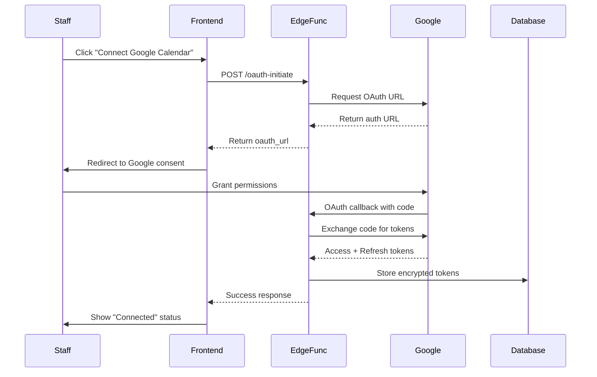
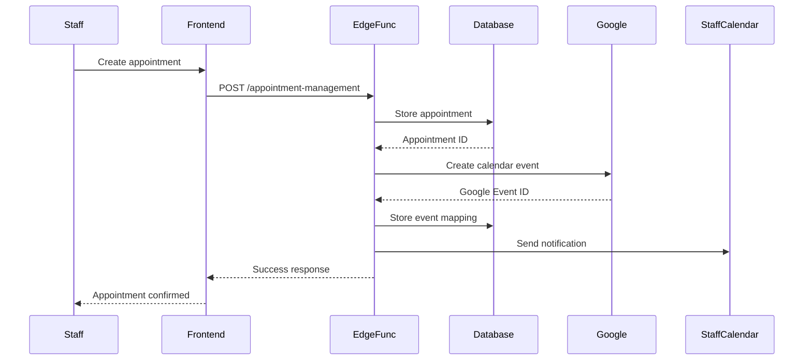
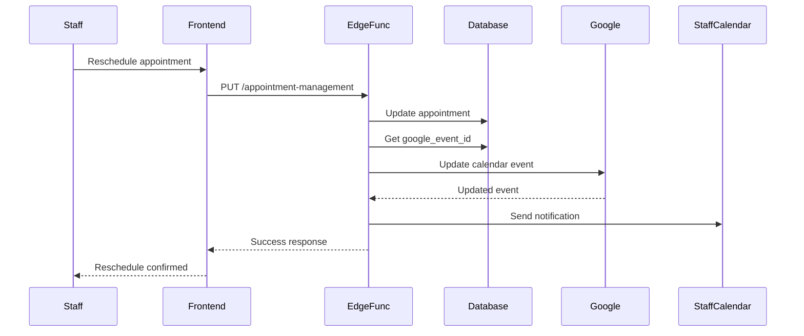
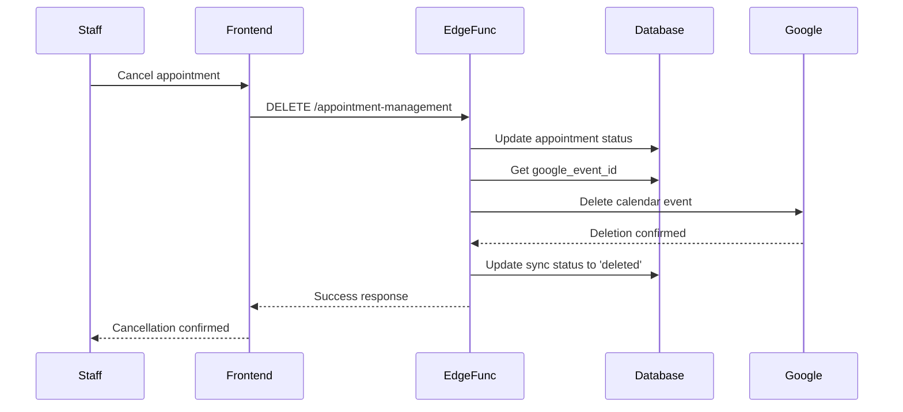

# Google Calendar Sync Feature - Architectural Plan

## 🎯 **Executive Summary**

This document outlines the complete architecture for a Google Calendar Sync feature that allows staff members to securely connect their personal Google Calendars to the Zavira Salon appointment system. The implementation will provide real-time availability sync, automatic appointment creation, and seamless integration with the existing staff scheduling system.

**Key Features:**
- OAuth 2.0 secure authentication flow
- Real-time calendar availability sync
- Automatic appointment event creation
- Staff-specific calendar management
- Bi-directional sync (create, update, delete)
- Secure token management and refresh handling

---

## 🔄 **OAuth 2.0 Flow Architecture**

### **1. Frontend OAuth Initiation**
```typescript
// Frontend: Initiate Google OAuth flow
const initiateGoogleCalendarSync = async () => {
  const response = await fetch('/functions/v1/google-calendar-sync', {
    method: 'POST',
    headers: {
      'Authorization': `Bearer ${staffAccessToken}`,
      'Content-Type': 'application/json'
    },
    body: JSON.stringify({
      action: 'oauth-initiate',
      staff_id: currentStaff.id
    })
  });

  const { oauth_url } = await response.json();
  // Redirect to Google OAuth consent screen
  window.location.href = oauth_url;
};
```

### **2. Google OAuth Consent Flow**


### **3. OAuth Callback Handler**
```typescript
// Edge Function: OAuth callback handler
const handleOAuthCallback = async (req: Request) => {
  const { code, state } = await req.json();
  
  // Exchange authorization code for access token
  const tokenResponse = await fetch('https://oauth2.googleapis.com/token', {
    method: 'POST',
    headers: { 'Content-Type': 'application/x-www-form-urlencoded' },
    body: new URLSearchParams({
      client_id: GOOGLE_CLIENT_ID,
      client_secret: GOOGLE_CLIENT_SECRET,
      code,
      grant_type: 'authorization_code',
      redirect_uri: OAUTH_REDIRECT_URI
    })
  });

  const tokens = await tokenResponse.json();
  
  // Store encrypted tokens in database
  await storeEncryptedTokens(state, tokens);
  
  return new Response(JSON.stringify({ success: true }), {
    headers: { ...corsHeaders, 'Content-Type': 'application/json' }
  });
};
```

---

## 🏗️ **Supabase Edge Function Design**

### **Function Structure: `google-calendar-sync`**

```typescript
// supabase/functions/google-calendar-sync/index.ts
serve(async (req: Request) => {
  const { action } = await req.json();

  switch (action) {
    case 'oauth-initiate':
      return initiateOAuthFlow(req);
    case 'oauth-callback':
      return handleOAuthCallback(req);
    case 'create-event':
      return createCalendarEvent(req);
    case 'update-event':
      return updateCalendarEvent(req);
    case 'delete-event':
      return deleteCalendarEvent(req);
    case 'sync-availability':
      return syncAvailability(req);
    case 'disconnect':
      return disconnectCalendar(req);
    default:
      return new Response('Invalid action', { status: 400 });
  }
});
```

### **Database Schema for OAuth Tokens**

```sql
-- Table to store Google Calendar OAuth credentials
CREATE TABLE staff_google_calendar_integrations (
  id UUID PRIMARY KEY DEFAULT gen_random_uuid(),
  staff_id UUID REFERENCES staff(id) ON DELETE CASCADE,
  google_calendar_id TEXT NOT NULL,
  access_token_encrypted TEXT NOT NULL,
  refresh_token_encrypted TEXT NOT NULL,
  token_expires_at TIMESTAMPTZ NOT NULL,
  calendar_sync_enabled BOOLEAN DEFAULT true,
  last_sync_at TIMESTAMPTZ,
  created_at TIMESTAMPTZ DEFAULT NOW(),
  updated_at TIMESTAMPTZ DEFAULT NOW(),
  UNIQUE(staff_id, google_calendar_id)
);

-- Table to track calendar event mappings
CREATE TABLE calendar_event_mappings (
  id UUID PRIMARY KEY DEFAULT gen_random_uuid(),
  appointment_id UUID REFERENCES appointments(id) ON DELETE CASCADE,
  google_event_id TEXT NOT NULL,
  staff_id UUID REFERENCES staff(id) ON DELETE CASCADE,
  sync_status TEXT DEFAULT 'active', -- active, deleted, error
  created_at TIMESTAMPTZ DEFAULT NOW(),
  updated_at TIMESTAMPTZ DEFAULT NOW(),
  UNIQUE(appointment_id)
);

-- Enable RLS
ALTER TABLE staff_google_calendar_integrations ENABLE ROW LEVEL SECURITY;
ALTER TABLE calendar_event_mappings ENABLE ROW LEVEL SECURITY;

-- RLS Policies
CREATE POLICY "Staff can manage own calendar integration" 
ON staff_google_calendar_integrations FOR ALL 
USING (staff_id = auth.jwt() ->> 'staff_id');

CREATE POLICY "Staff can manage own event mappings" 
ON calendar_event_mappings FOR ALL 
USING (staff_id = auth.jwt() ->> 'staff_id');
```

---

## 🎨 **Frontend Component Design**

### **1. Calendar Integration Component**

```typescript
// src/components/GoogleCalendarIntegration.tsx
import React, { useState, useEffect } from 'react';

interface GoogleCalendarIntegrationProps {
  staffId: string;
  onStatusChange: (status: CalendarSyncStatus) => void;
}

const GoogleCalendarIntegration: React.FC<GoogleCalendarIntegrationProps> = ({
  staffId,
  onStatusChange
}) => {
  const [syncStatus, setSyncStatus] = useState<CalendarSyncStatus>('disconnected');
  const [isLoading, setIsLoading] = useState(false);

  const handleConnect = async () => {
    setIsLoading(true);
    try {
      const response = await fetch('/functions/v1/google-calendar-sync', {
        method: 'POST',
        headers: {
          'Authorization': `Bearer ${getStaffAccessToken()}`,
          'Content-Type': 'application/json'
        },
        body: JSON.stringify({
          action: 'oauth-initiate',
          staff_id: staffId
        })
      });

      const { oauth_url } = await response.json();
      window.location.href = oauth_url;
    } catch (error) {
      console.error('Failed to initiate OAuth:', error);
    } finally {
      setIsLoading(false);
    }
  };

  const handleDisconnect = async () => {
    setIsLoading(true);
    try {
      await fetch('/functions/v1/google-calendar-sync', {
        method: 'POST',
        headers: {
          'Authorization': `Bearer ${getStaffAccessToken()}`,
          'Content-Type': 'application/json'
        },
        body: JSON.stringify({
          action: 'disconnect',
          staff_id: staffId
        })
      });

      setSyncStatus('disconnected');
      onStatusChange('disconnected');
    } catch (error) {
      console.error('Failed to disconnect:', error);
    } finally {
      setIsLoading(false);
    }
  };

  return (
    <div className="bg-white p-6 rounded-lg shadow-sm border">
      <div className="flex items-center justify-between">
        <div>
          <h3 className="text-lg font-semibold text-gray-900">
            Google Calendar Sync
          </h3>
          <p className="text-sm text-gray-600">
            Connect your Google Calendar to automatically sync appointments
          </p>
        </div>
        
        <div className="flex items-center space-x-3">
          {/* Sync Status Indicator */}
          <div className={`px-3 py-1 rounded-full text-xs font-medium ${
            syncStatus === 'connected' 
              ? 'bg-green-100 text-green-800'
              : 'bg-gray-100 text-gray-800'
          }`}>
            {syncStatus === 'connected' ? '🟢 Connected' : '⚪ Not Connected'}
          </div>

          {/* Action Button */}
          {syncStatus === 'connected' ? (
            <button
              onClick={handleDisconnect}
              disabled={isLoading}
              className="px-4 py-2 text-sm font-medium text-red-700 bg-red-100 rounded-lg hover:bg-red-200 disabled:opacity-50"
            >
              {isLoading ? 'Disconnecting...' : 'Disconnect'}
            </button>
          ) : (
            <button
              onClick={handleConnect}
              disabled={isLoading}
              className="px-4 py-2 text-sm font-medium text-white bg-blue-600 rounded-lg hover:bg-blue-700 disabled:opacity-50"
            >
              {isLoading ? 'Connecting...' : 'Connect Google Calendar'}
            </button>
          )}
        </div>
      </div>

      {/* Connection Details */}
      {syncStatus === 'connected' && (
        <div className="mt-4 p-3 bg-green-50 border border-green-200 rounded-lg">
          <p className="text-sm text-green-800">
            ✅ Google Calendar integration is active. Appointments will automatically sync to your calendar.
          </p>
        </div>
      )}
    </div>
  );
};
```

### **2. Staff Dashboard Integration**

```typescript
// src/pages/StaffDashboard.tsx - Integration Point
import GoogleCalendarIntegration from '../components/GoogleCalendarIntegration';

const StaffDashboard: React.FC = () => {
  const [currentStaff, setCurrentStaff] = useState<Staff | null>(null);
  const [calendarSyncStatus, setCalendarSyncStatus] = useState('disconnected');

  return (
    <div className="space-y-6">
      {/* Existing dashboard content */}
      
      {/* Google Calendar Integration Section */}
      {currentStaff && (
        <GoogleCalendarIntegration
          staffId={currentStaff.id}
          onStatusChange={setCalendarSyncStatus}
        />
      )}
      
      {/* Rest of dashboard */}
    </div>
  );
};
```

---

## 🔐 **Security and Privacy Considerations**

### **1. Token Encryption**
```typescript
// Encryption utilities for storing OAuth tokens
import crypto from 'crypto';

const ENCRYPTION_KEY = process.env.TOKEN_ENCRYPTION_KEY || crypto.randomBytes(32);
const ALGORITHM = 'aes-256-gcm';

export const encryptToken = (token: string): string => {
  const iv = crypto.randomBytes(12);
  const cipher = crypto.createCipher(ALGORITHM, ENCRYPTION_KEY);
  cipher.setAAD(Buffer.from('google-calendar'));
  
  let encrypted = cipher.update(token, 'utf8', 'hex');
  encrypted += cipher.final('hex');
  
  const auth_tag = cipher.getAuthTag();
  
  return `${iv.toString('hex')}:${auth_tag.toString('hex')}:${encrypted}`;
};

export const decryptToken = (encryptedToken: string): string => {
  const [ivHex, authTagHex, encrypted] = encryptedToken.split(':');
  
  const iv = Buffer.from(ivHex, 'hex');
  const auth_tag = Buffer.from(authTagHex, 'hex');
  
  const decipher = crypto.createDecipher(ALGORITHM, ENCRYPTION_KEY);
  decipher.setAAD(Buffer.from('google-calendar'));
  decipher.setAuthTag(auth_tag);
  
  let decrypted = decipher.update(encrypted, 'hex', 'utf8');
  decrypted += decipher.final('utf8');
  
  return decrypted;
};
```

### **2. Permission Scopes**
```typescript
// Google Calendar API scopes needed
const GOOGLE_CALENDAR_SCOPES = [
  'https://www.googleapis.com/auth/calendar',          // Full calendar access
  'https://www.googleapis.com/auth/calendar.events',   // Manage events
  'https://www.googleapis.com/auth/calendar.readonly'  // Read calendar
];

// OAuth URL construction with appropriate scopes
const getOAuthUrl = (state: string) => {
  return `https://accounts.google.com/o/oauth2/v2/auth?` + 
    new URLSearchParams({
      client_id: GOOGLE_CLIENT_ID,
      redirect_uri: OAUTH_REDIRECT_URI,
      scope: GOOGLE_CALENDAR_SCOPES.join(' '),
      response_type: 'code',
      access_type: 'offline', // Required for refresh token
      prompt: 'consent',      // Force consent to get refresh token
      state: state
    }).toString();
};
```

### **3. Data Privacy**
- **Minimal Data Access**: Only access calendar data necessary for appointment sync
- **Secure Storage**: All tokens encrypted at rest using AES-256-GCM
- **User Control**: Staff can disconnect at any time, revoking all access
- **Audit Trail**: Log all calendar sync activities for security monitoring
- **Data Retention**: Automatically clean up tokens when staff member is removed

---

## 🌍 **Environment Variables Required**

### **Google OAuth Configuration**
```bash
# Add to .env.template and production environment

# Google OAuth 2.0 Credentials
GOOGLE_CLIENT_ID=your_google_client_id_here
GOOGLE_CLIENT_SECRET=your_google_client_secret_here

# OAuth Redirect URI
GOOGLE_OAUTH_REDIRECT_URI=https://your-domain.com/functions/v1/google-calendar-sync

# Token Encryption
TOKEN_ENCRYPTION_KEY=your_32_character_encryption_key_here

# Optional: Webhook endpoint for real-time calendar updates
GOOGLE_CALENDAR_WEBHOOK_URL=https://your-domain.com/functions/v1/google-calendar-webhook
```

### **Supabase Configuration**
```bash
# These should already exist in your environment
SUPABASE_URL=your_supabase_url
SUPABASE_SERVICE_ROLE_KEY=your_service_role_key
```

---

## 🔄 **Calendar Event Management Flow**

### **1. Create Appointment → Create Calendar Event**


### **2. Update Appointment → Update Calendar Event**


### **3. Delete Appointment → Delete Calendar Event**


---

## 📊 **Implementation Timeline**

### **Phase 1: Core Infrastructure (Week 1)**
- [ ] Set up database schema for OAuth tokens
- [ ] Create basic Google Calendar edge function
- [ ] Implement OAuth 2.0 flow
- [ ] Add encryption utilities

### **Phase 2: Calendar Operations (Week 2)**
- [ ] Implement create calendar event functionality
- [ ] Implement update calendar event functionality  
- [ ] Implement delete calendar event functionality
- [ ] Add error handling and retry logic

### **Phase 3: Frontend Integration (Week 3)**
- [ ] Create GoogleCalendarIntegration component
- [ ] Add to staff dashboard
- [ ] Implement connection status management
- [ ] Add sync status indicators

### **Phase 4: Testing & Security (Week 4)**
- [ ] Security audit and penetration testing
- [ ] OAuth flow testing with multiple Google accounts
- [ ] Performance testing with large appointment volumes
- [ ] Documentation and deployment guide

---

## 🚀 **Deployment Considerations**

### **1. Google Cloud Console Setup**
1. Create Google Cloud Project
2. Enable Google Calendar API
3. Create OAuth 2.0 credentials
4. Configure authorized redirect URIs
5. Set appropriate API restrictions

### **2. Production Security Checklist**
- [ ] HTTPS enforced for all OAuth flows
- [ ] CSRF protection implemented
- [ ] Rate limiting on edge functions
- [ ] Token encryption key rotation strategy
- [ ] Regular security audits scheduled
- [ ] Monitoring and alerting for failed sync operations

### **3. Monitoring & Observability**
- Track OAuth success/failure rates
- Monitor token refresh success
- Alert on sync failures
- Log all calendar operations
- Track user engagement with calendar sync

---

## 📞 **Support & Maintenance**

### **Troubleshooting Common Issues**

1. **OAuth Token Expired**
   - Automatically refresh using stored refresh token
   - Implement graceful fallback to database-only sync

2. **Google API Quota Exceeded**
   - Implement exponential backoff retry logic
   - Cache calendar data to reduce API calls
   - Monitor API usage and set up alerts

3. **Calendar Sync Conflicts**
   - Implement conflict resolution strategies
   - Use optimistic locking for concurrent updates
   - Provide manual override options for staff

This comprehensive architecture provides a secure, scalable, and maintainable solution for Google Calendar integration that seamlessly extends the existing Zavira Salon scheduling system.