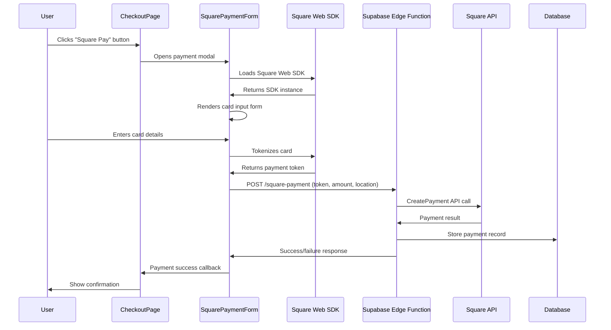

# Square Payment Integration - Architectural Implementation Plan

## Architecture Overview

### Current System State
The Zavira beauty service booking system has a partially implemented Square payment integration that needs completion. The backend infrastructure is solid, but frontend integration and environment configuration require attention.

### Component Analysis

#### 1. Frontend Components
- **CheckoutPage.tsx**: ✅ Complete checkout interface with payment method selection
- **SquarePaymentForm.tsx**: ⚠️ Needs API endpoint fix and SDK integration
- **SquareProvider.tsx**: ✅ Provider component ready
- **src/lib/square.ts**: ⚠️ Has mock implementation, needs real SDK

#### 2. Backend Components  
- **supabase/functions/square-payment/index.ts**: ✅ Complete Edge Function implementation
- **Database**: ✅ Payments table with Square support

#### 3. Environment Configuration
- **Current**: Missing all Square environment variables
- **Required**: Need to add Square credentials to .env file

## Implementation Flow

### Data Flow Diagram


## Required Implementation Steps

### 1. Environment Configuration
**Status**: ❌ Missing  
**Action**: Add Square credentials to .env file

Required variables:
```env
VITE_SQUARE_APPLICATION_ID=your_application_id
VITE_SQUARE_LOCATION_ID=your_location_id  
VITE_SQUARE_ACCESS_TOKEN=your_access_token
SQUARE_ACCESS_TOKEN=your_access_token
SQUARE_ENVIRONMENT=sandbox
```

### 2. Frontend API Endpoint Fix
**Status**: ❌ Wrong endpoint  
**File**: `src/components/SquarePaymentForm.tsx`  
**Issue**: Line 134 calls `/api/square-payment`  
**Fix**: Should call Supabase Edge Function at correct endpoint

### 3. Complete Square SDK Integration  
**Status**: ⚠️ Mock implementation  
**File**: `src/lib/square.ts`  
**Issue**: Contains mock client and functionality  
**Fix**: Remove mock, use real Square SDK

### 4. Deploy Supabase Edge Function
**Status**: ⚠️ Needs verification  
**File**: `supabase/functions/square-payment/index.ts`  
**Action**: Ensure function is deployed and accessible

### 5. End-to-End Testing
**Status**: ❌ Not tested  
**Action**: Verify complete payment flow

### 6. Security Validation
**Status**: ⚠️ Partial  
**Action**: Ensure all sensitive operations are properly secured

## Security Architecture

### Frontend Security
- ✅ Uses Application ID and Location ID only (safe to expose)
- ✅ Card tokenization happens in Square's secure iframe
- ✅ Never handles raw card data
- ❌ Missing environment variable validation

### Backend Security  
- ✅ Access Token stored securely in Edge Function environment
- ✅ Server-side payment processing only
- ✅ CORS headers properly configured
- ✅ Input validation and sanitization

### Data Protection
- ✅ Payment tokens are single-use and secure
- ✅ Sensitive data never logged
- ✅ Database stores only payment references, not card data

## Payment Flow Implementation

### Frontend Flow
1. **Initialization**: Load Square Web SDK from CDN
2. **Card Form**: Render secure card input in iframe
3. **Tokenization**: Convert card details to secure payment token
4. **API Call**: Send token to Supabase Edge Function
5. **Response Handling**: Process payment result and update UI

### Backend Flow
1. **Token Validation**: Verify payment token from frontend
2. **Payment Creation**: Call Square CreatePayment API
3. **Database Storage**: Record payment in transactions table
4. **Response**: Return payment result to frontend

## Error Handling Strategy

### Frontend Errors
- SDK loading failures
- Card tokenization errors
- Network/API communication issues
- Payment processing failures

### Backend Errors
- Invalid payment tokens
- Insufficient funds
- API rate limits
- Database failures

## Testing Strategy

### Sandbox Testing
- Use Square sandbox environment
- Test card numbers for various scenarios
- Verify error handling
- Test payment flow completion

### Production Readiness
- Environment variable validation
- API endpoint verification
- Error boundary testing
- Performance optimization

## Migration from Mock to Real Implementation

### Files to Update
1. **src/lib/square.ts**: Replace mock client with real SDK
2. **src/components/SquarePaymentForm.tsx**: Fix API endpoint and SDK usage
3. **.env**: Add required environment variables

### Backward Compatibility
- Maintain existing interfaces
- Preserve payment success/error handling
- Keep database schema unchanged

## Deployment Checklist

- [ ] Environment variables configured
- [ ] Square credentials added to .env
- [ ] API endpoint fixed in SquarePaymentForm
- [ ] Mock functionality removed from square.ts
- [ ] Supabase Edge Function deployed
- [ ] End-to-end payment flow tested
- [ ] Error handling verified
- [ ] Production environment tested

## Next Steps

1. **Immediate**: Environment configuration and API endpoint fix
2. **Short-term**: SDK integration and Edge Function deployment
3. **Medium-term**: Comprehensive testing and optimization
4. **Long-term**: Production deployment and monitoring

## Risk Mitigation

- **Credential Exposure**: Use environment variables only
- **Payment Failures**: Implement retry logic and user feedback
- **API Changes**: Monitor Square SDK updates
- **Security Breaches**: Regular security audits and updates